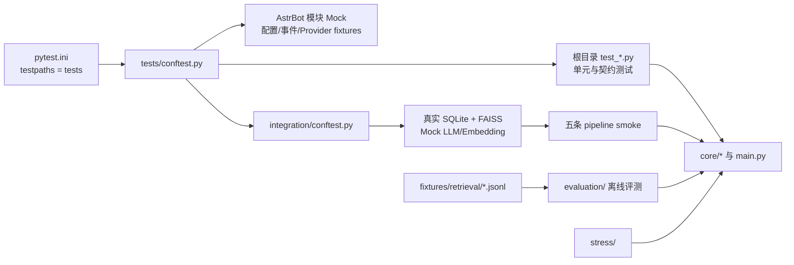

[`根级 AGENTS.md`](../AGENTS.md) > **tests**

# Tests 模块上下文

**最后更新：** 2026-07-19
**入口：** `pytest.ini`、`tests/conftest.py`、`tests/integration/conftest.py`

## 职责与边界

`tests/` 是 Memora Python 侧的行为回归、契约、集成 smoke、离线检索评测与并发压力验证区。测试从公开接口或稳定的模块边界观察行为；生产代码不得反向导入 `tests`，测试辅助设施也不得成为运行时依赖。

- 根目录 `test_*.py`：按被测领域组织单元、API、Store/Manager、处理器、配置和包导出契约。
- `integration/`：以真实 SQLite、真实 FAISS 索引和 Mock Provider 组装跨模块管线；它是 `scripts/run_smoke.py` 的五条固定目标。
- `evaluation/`：验证 JSONL 数据集加载、Recall@K/MRR/nDCG/延迟指标、variant 对比和报告持久化。
- `stress/`：覆盖并发写入等竞争条件；不要把机器抖动敏感的绝对耗时阈值放进这里。
- `fixtures/retrieval/`：五组离线检索样本，每组 10 条，共 50 条；`noise_negative.jsonl` 用 `expected_no_hit` 与 `__no_relevant__` 表达负样本。
- Memory Evolution 相关用例覆盖 `memory_evolution.jsonl`、gate/manager/store、derived relation、ProjectionReader、Recall metadata、formatter allowlist/budget 与插件生命周期；Projection 只能作为 source-backed canonical candidate 注解。

不在本目录承担：生产实现、真实 AstrBot 服务启动、真实模型/网络调用、Dashboard 组件测试、发布说明或普通设计文档维护。

## 组织与依赖方向



依赖只能从测试指向运行代码：

1. `pytest` 先加载根 `conftest.py`，将最小 AstrBot 包层级注入 `sys.modules`。
2. 只有在 AstrBot Mock 安装完成后，测试才应导入依赖 `astrbot.*` 的 `core.*` 模块。
3. `integration/conftest.py` 复用根 fixtures，再增加真实存储与完整 `MemoryEngine` 装配。
4. `scripts/run_smoke.py` 从脚本层调用五个集成测试文件；测试本身不调用脚本层。
5. `core/evaluation` 读取 `fixtures/retrieval`；fixture schema 变化必须同步服务和评测测试。

## 关键入口与 Fixture 契约

### `pytest.ini`

当前只声明 `testpaths = tests`。不要假设根配置已经注册任意 `unit` 标记或全局 `asyncio_mode`。

### `tests/conftest.py`

加载顺序是硬约束：`_install_astrbot_mocks()` 必须在任何依赖 AstrBot 的 `core.*` 导入之前执行。主要 fixture：

| Fixture | 作用 | 隔离要求 |
|---|---|---|
| `mock_llm_caller` | 返回固定 JSON 摘要的 `AsyncMock` | 测试内覆盖 `return_value`，不得访问真实模型 |
| `mock_llm_provider` | 只暴露稳定模型名的 Provider 替身 | 不增加隐式网络行为 |
| `test_config_dict` | 覆盖核心逻辑的最小配置字典 | 修改默认值时同步配置契约测试 |
| `test_config` | 支持点号路径读取的轻量配置对象 | 专门验证 Pydantic 时不要用它替代真实验证链 |
| `tmp_db_path` | 每测试独立的文件型 SQLite 路径 | fixture 负责删除；不要写固定仓库路径 |
| `sample_atoms` | 五种 MemoryAtom 类型的确定性样本 | 保留类型、时间与元数据覆盖 |
| `mock_event` / `mock_context` | AstrBot 事件与上下文替身 | 只补当前测试所需行为 |
| `mock_feature_delegation*` | 无伴侣、自学习、ChatPlus 三种委托状态 | 保持状态字段相互一致 |
| `mock_monitored_context` | 临时开启监控调试/trace | 必须在 teardown 恢复默认状态 |

### `tests/integration/conftest.py`

- `integration_db_path` 为函数作用域，支持随机顺序与并行执行时的数据隔离。
- `integration_faiss` 使用 128 维 `faiss.IndexFlatIP`；embedding fixture 也必须返回 128 维。
- `integration_config` 从 `test_config_dict` 复制后开启 Graph/Atom，避免污染共享配置。
- `integration_engine` 初始化真实 `MemoryEngine`，关闭阶段必须释放连接。
- `preloaded_engine` 插入五类种子原子并同步 FAISS；依赖子系统不可用时使用明确 `pytest.skip`，不得把环境缺失伪装为通过。
- 该文件注册 `integration` 标记并设置 asyncio 自动模式；根测试不要依赖这个子目录配置。

### 检索评测 Fixture

每行都是独立 JSON 对象，至少保留 `case_id`、`query`、`relevant_doc_ids`、`metadata.dataset` 与检索上下文。各数据集职责：

| 数据集 | 覆盖重点 |
|---|---|
| `private_basic.jsonl` | 私聊事实、偏好、计划与边界 |
| `group_topic_shift.jsonl` | 群聊话题切换、决策和归属 |
| `emotion_context.jsonl` | 情绪、语气和支持偏好 |
| `graph_relation.jsonl` | 关系、来源、依赖和多跳图召回 |
| `noise_negative.jsonl` | 无相关结果、错人/错群/虚假关系 |

不要用测试名称或 fixture 文本替代真实断言；评测必须对结果 ID、指标、状态或持久化输出作可观察验证。

## 变更定位

| 变更类型 | 首选测试位置 | 常见相邻门禁 |
|---|---|---|
| Page API 请求/响应 | `test_api_<domain>.py` | `test_page_api.py`、`test_page_api_contract.py` |
| Store/SQL/事务 | `test_<store>.py` | 相关 Manager/API 测试、并发冲突测试 |
| Manager 业务规则 | `test_managers_<domain>.py` 或领域文件 | 对应 Store 与 API 测试 |
| 召回、注入、格式化 | `test_handlers.py`、`test_injection_*.py`、`test_memory_formatter.py` | `integration/test_pipeline_event.py`、`test_recall_cost_benchmark.py` |
| 配置/schema | `test_base.py`、`test_config_contract.py`、`test_api_config.py` | `test_plugin_init.py`、`test_project_metadata.py` |
| 插件初始化/导入 | `test_plugin_init.py`、`test_plugin_package_imports.py` | `test_event_handler.py` |
| 检索质量 | `evaluation/` 与 `fixtures/retrieval/` | 相关 retriever 单测 |
| 跨模块主路径 | `integration/test_pipeline_*.py` | `python scripts/run_smoke.py -q` |

## 精确验证命令

均从仓库根目录执行。先跑最小相关文件，再扩大范围；本模块文档变更本身不要求启动服务。

```bash
# 单文件行为回归
python -m pytest tests/test_<domain>.py -q

# 单个测试节点
python -m pytest tests/test_<domain>.py::TestClass::test_behavior -q

# Page API 契约变更
python -m pytest tests/test_api_<domain>.py tests/test_page_api_contract.py -q

# 检索评测数据或服务变更
python -m pytest tests/evaluation/test_retrieval_quality.py tests/evaluation/test_evaluation_service.py -q

# 单条真实管线
python -m pytest tests/integration/test_pipeline_ingest.py -q

# 五条集成 smoke；脚本会全部运行后汇总
python scripts/run_smoke.py -q

# 完整 Python 回归，仅在影响跨域契约或准备合并时运行
python -m pytest tests -q
```

Windows 沙箱下优先为 pytest 指定仓库内可写的 `--basetemp`，避免工作树 `.pytest_cache` 权限告警掩盖真实结果，例如：

```powershell
python -m pytest tests/test_memory_evolution_store.py tests/test_projection_reader.py tests/test_dual_route_retriever.py tests/test_memory_formatter.py -q --basetemp .tmp-agents-focused
```

Memory Evolution 变更的最窄回归还应覆盖：

```powershell
python -m pytest tests/test_memory_evolution_models.py tests/test_memory_evolution_gate.py tests/test_memory_evolution_manager.py tests/test_memory_evolution_store.py tests/test_derived_relation_expander.py tests/test_projection_reader.py tests/test_recall_projection_metadata.py tests/test_memory_consolidator.py tests/test_plugin_init.py -q --basetemp .tmp-agents-evolution
```

若改动 `fixtures/retrieval/*.jsonl`，至少运行两条 evaluation 测试；若改动根 fixture 或 AstrBot Mock，至少运行直接消费者和 `tests/test_plugin_package_imports.py`。不要仅凭 collection 成功判断行为通过。

## 约束与禁止事项

- 禁止在根 `conftest.py` 安装 AstrBot Mock 之前导入依赖 AstrBot 的生产模块。
- 禁止测试访问真实 LLM、Embedding Provider、用户数据目录或生产 SQLite。
- 禁止共享可变模块状态而不在 fixture teardown 中恢复；并行与随机顺序必须安全。
- 禁止硬编码开发机临时目录、绝对路径、凭据、API key 或用户标识。
- 禁止把 `sleep` 和宽松超时当作并发正确性的证明；使用事件、锁、屏障或可控 mock。
- 禁止在普通 pytest 中加入专用性能基准的绝对毫秒阈值；性能门由 `scripts/` 的确定性 benchmark 承担。
- 禁止无理由 `skip`/`xfail`；环境能力缺失必须写出明确条件，核心契约失败不能跳过。
- 禁止修改测试来迎合错误实现；先确认公开契约与调用方，再修根因。
- 禁止依赖测试执行顺序、前一测试的数据库内容或仓库中生成物。

## 相关上下文

- [脚本与质量门禁](../scripts/AGENTS.md)
- [普通文档维护](../docs/AGENTS.md)
